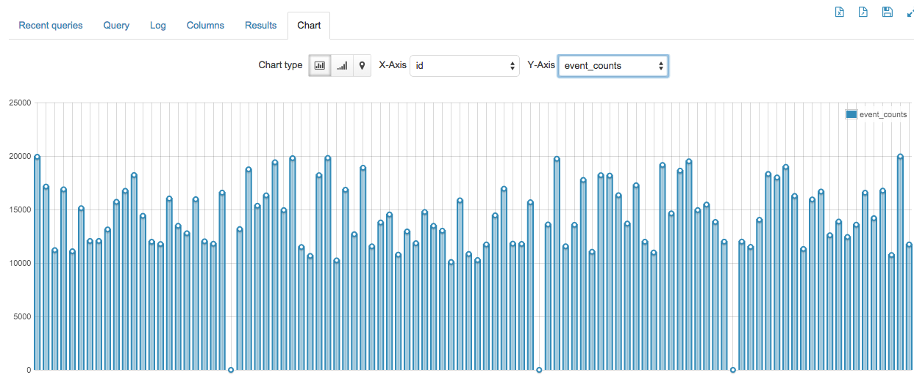
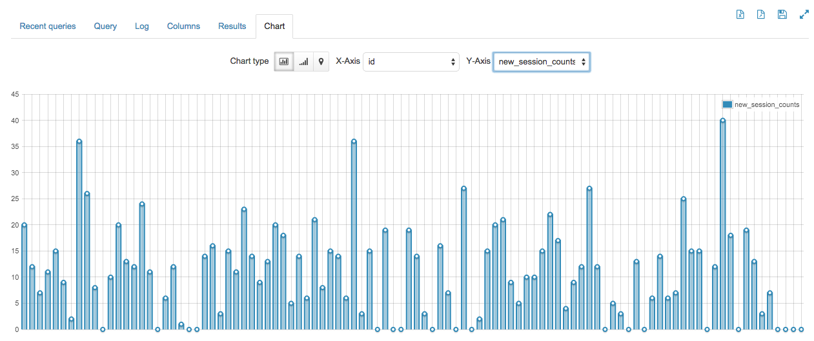

Spark Stream Sessionization Visualization
------------------------------

We can get NRT picture of stats like.

Here are the things we are tracking with aggregation:

- Number of events
- Number of active sessions
- Average session time
- Number of new sessions
- Number of dead sessions

This will give us graphs like the following

